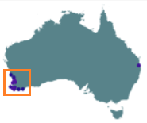

AusTraits_Analysis
==================
> This is a machine learning analysis of AusTraits; a curated plant trait database for Australian Flora. The goal is to identify local native plant species using easily measurable traits.
> 
> The main website for [AusTraits](https://austraits.org/) provides up to date information on the database and access methods via Zenodo, R interface and an API:
> `"It synthesises data on nearly 500 traits across more than 30,000 taxa from field campaigns, published literature, taxonomic monographs, and individual taxon descriptions."`

# 1. Problem Statement
Develop machine learning algorithm to identify local native plant species using easily measurable traits. "Local" to be defined, but approximately indicated here, within the orange border:

